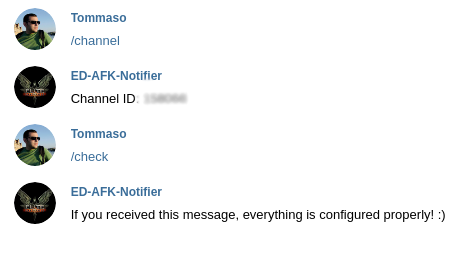
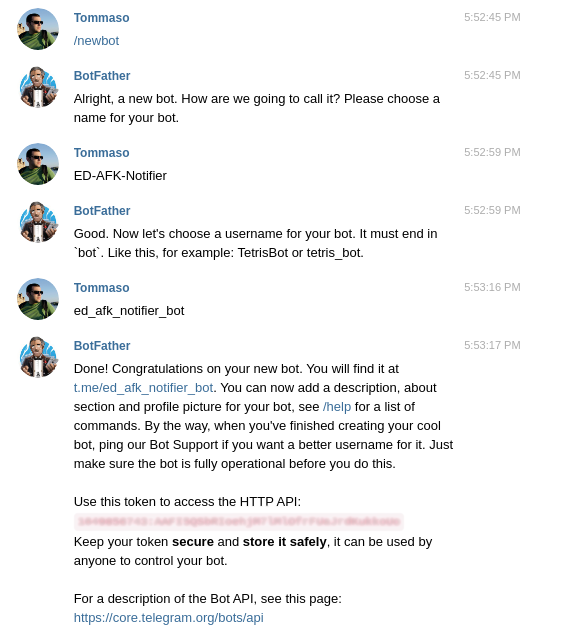

# Elite Dangerous AFK notifier

This tool can help Elite Dangerous Commanders when playing with their
[AFK Build](https://www.youtube.com/watch?v=aEv7K8ml3YY).

The tool monitors the game [journal file](http://edcodex.info/?m=doc) for
hull damages and, in that case, immediately sends a
[Telegram](https://telegram.org/) message to alert the Commander.

## Usage

[Download the binary](https://github.com/tommyblue/ED-AFK-Notifier/releases) for your operating system
(Windows or Linux), place it somewhere and create, in the same folder, a file named `config.toml`
(see below for its content).

If you have problems extracting the release file (tar.gz), use [7-zip](https://www.7-zip.org/download.html).

Launch the game and, after you're sitting in your ship, run this program (don't run the program
before launching ED or the tool could monitor the wrong journal file).

## Configuration

The `config.toml` file, that must be placed along with the downloaded binary, must have the
following content:

```toml
[journal]
    Path = "<path to the journal directory>"

[telegram]
    token = "<bot token>"
    channelId = <channel ID>
```


The journal path (that is the folderwhere ED saves journal files) under Windows is like:
`C:\\Users\\<Your User>\\Saved Games\\Frontier Developments\\Elite Dangerous`, just replace
`<Your User>` with your username.

If you run the game under Linux with Steam Proton, the path is something like:
`/home/<username>/.local/share/Steam/steamapps/compatdata/<numeric id>/pfx/drive_c/users/steamuser/Saved Games/Frontier Developments/Elite Dangerous/"`
(edit `<username>` and `<numeric id>` accordingly to your installation).

Create a Telegram bot (see below) and replace `<bot token>` with the token you get from BotFather.

At this point the `channelId` is still unknown but it is required to receive messages
from the bot.

**Don't worry**, the bot itself can send you the id.

Run the bot and send it a message with the text `/channel`. You'll receive the channel id in the
response message.  
Copy the value and replace `<channel ID>` in the configuration file with that value, then restart
the bot.  

You can send a `/check` message to verify the configuration. You should receive a message
from this tool.



## How to create the Telegram bot

[Creating a Telegram bot](https://core.telegram.org/bots#3-how-do-i-create-a-bot) is a simple task
as you can easily do it sending messages with the BotFather bot. The screenshot below shows the
simple steps required to create a bot:


